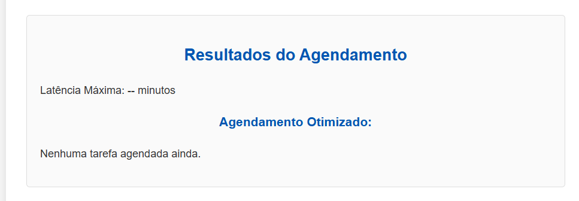
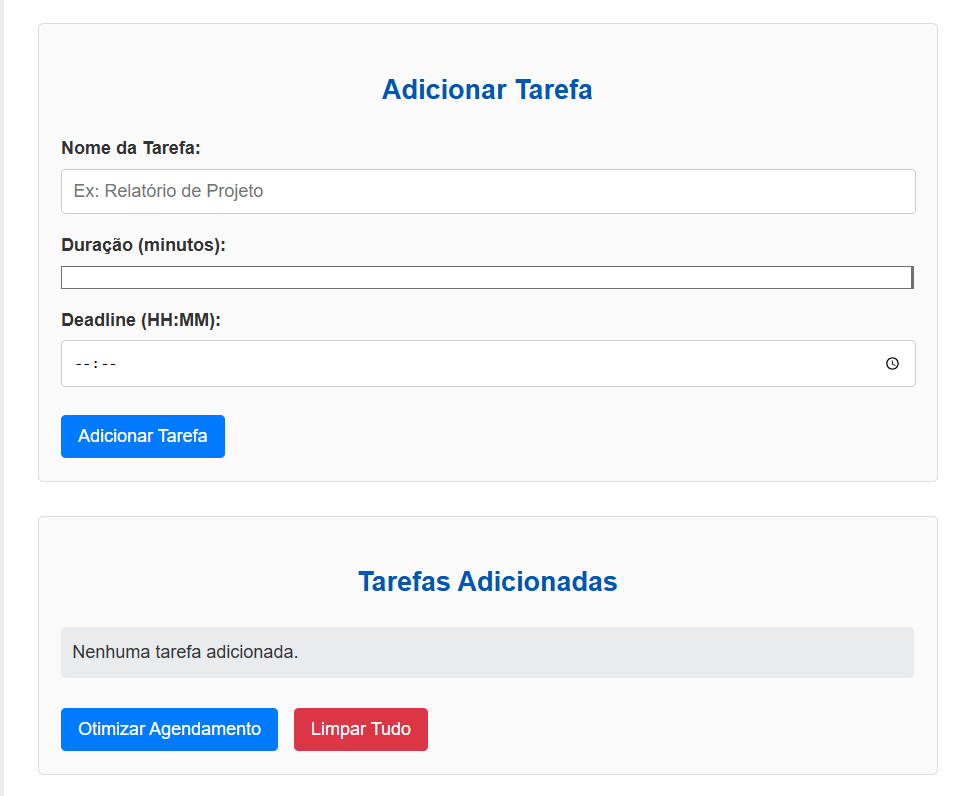
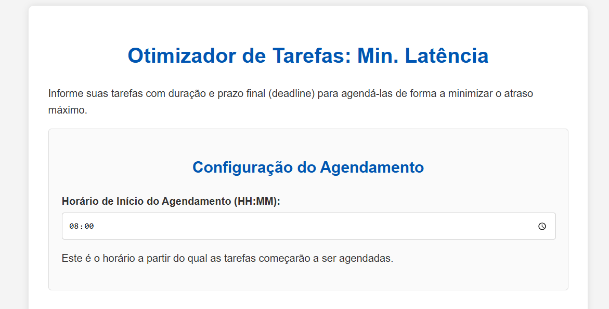

# Greedy_Shortest_Delay_Time

**Número da Lista**: X 
**Conteúdo da Disciplina**: Projeto de Algoritmos 

## Alunos
| Matrícula | Aluno |
| -- | -- |
| 22/1007958  |  Cláudio Henrique dos Santos Carvalho |
| 22/1007706  |  Elias Faria de Oliveira |

## Sobre
O Greedy Shortest Delay Time é um sistema com o objetivo de gerenciar tarefas, de modo que minimize ao máximo possível o tempo de atraso caso ocorra. O Sistema utiliza o algoritmo ambicioso Scheduling Min Lateness.

## Screenshots

Screenshot da tela Home do projeto:

### Área de resultados

### Área de Adicionar tarefas

### Área de definição do horário de início do agendamento

## Vídeo de apresentação e explicação do sistema TaskList

## Instalação
**Linguagens**: HTML5, JavaScript e CSS3.

## Uso
Para acessar entre no link do [GitHub Pages](https://projeto-de-algoritmos-2025.github.io/Greedy_Otimized_Timetable/).

## Funcionamento da Aplicação:

- Ao acessar a aplicação, defina o horário ao qual deseja iniciar o agendamento das tarefas.
- Após Cadastre a tarefa adicionando: Nome da tarefa, Duração em minutos e a Deadline e clique em adicionar tarefa
- Posteriormente na seção tarefas adicionadas clique em otimizar agendamento para verificar as tarefas já ordenadas com a menor latência.

## Outros 
Quaisquer outras informações sobre seu projeto podem ser descritas abaixo.
